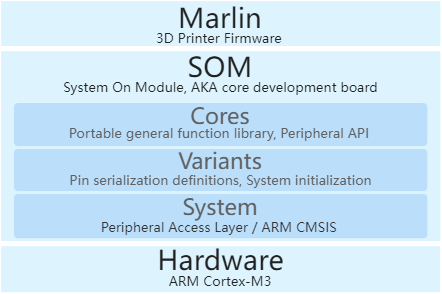
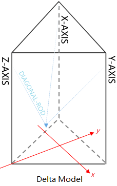
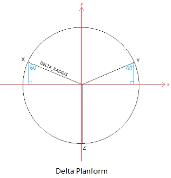
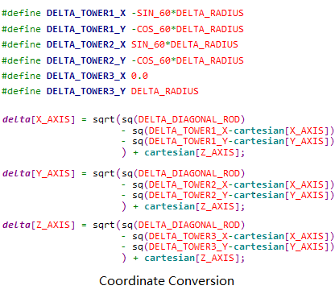
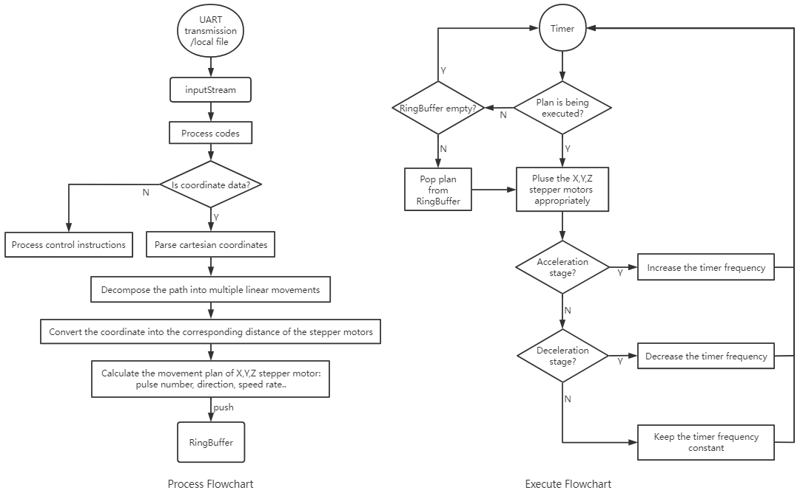

# Marlin 3D Printer Firmware

## Feature extension

### 1. Support the ARM Cortex-M3 32-bit processor.

- Delta model have been ported to STM32F1. 
- Platform-specific are integrated in this project's **som** module.

### 2. Support fast log.

  The file transfer job is no longer synchronized with the print job, allowing UART transmission to complete as fast as possible, and no longer waiting for a long time print job process.

### 3. Support Chinese display through 128x64 LCD.

## Architecture

## Sketch
                

## Marlin flowchart

## How to use

1. Importing this existing project into Eclipse CDT workspace.
2. Make sure the cross toolchain path is modified to your own!
2. ***som/variants/variant.cpp*** and ***variant.h*** can be modified to adapt to your own core board.
2. ***marlin/pins.h*** can be modified to adapt to your own hardware connection.
2. ***marlin/Configuration\**.h** can configure personalization settings.

## Pre-adjusted

After DIY, you need to ensure the consistency of the movement of all stepper motors, or you may get the wired moving trajectory! 

It's NOT a software bug, but some hardware adjustment must be done first: 

1. Let the 3 carries of the printer towers move from top to bottom at a constant speed at the same time. 

2. Observe the different in travel distance.

3. Then adjust the driving current of the stepping motors respectively until the nozzle is finally positioned at the center of the worktable!

## Origin

- [github.com/MarlinFirmware/Marlin](https://github.com/MarlinFirmware/Marlin)
- [marlinfw.org](https://marlinfw.org/)

## License

Marlin is published under the [GPL license](https://github.com/COPYING.md) because we believe in open development. The GPL comes with both rights and obligations. Whether you use Marlin firmware as the driver for your open or closed-source product, you must keep Marlin open, and you must provide your compatible Marlin source code to end users upon request. The most straightforward way to comply with the Marlin license is to make a fork of Marlin on Github, perform your modifications, and direct users to your modified fork.

While we can't prevent the use of this code in products (3D printers, CNC, etc.) that are closed source or crippled by a patent, we would prefer that you choose another firmware or, better yet, make your own.